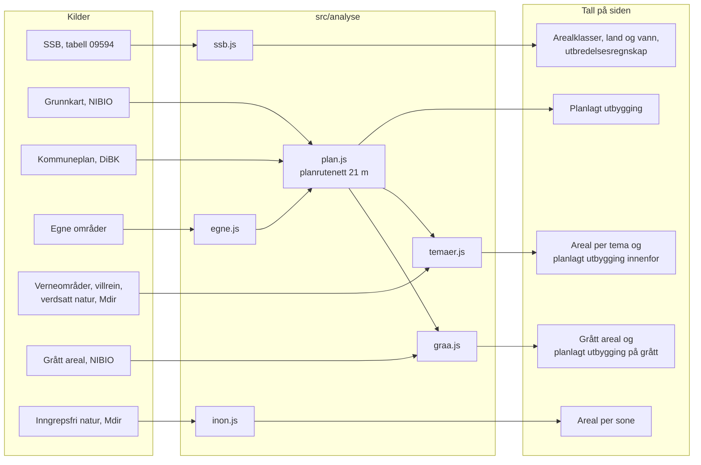

# Metode: hvordan tallene regnes ut

Dette dokumentet forklarer hvert tall siden viser: hvor dataene kommer fra, hvordan de regnes om, hvor sikkert resultatet er, og
hvordan det er kontrollert. Det følger koden slik den var 10. oktober 2026.

Dokumentet har samme inndeling som koden. Hver analyse har sin egen fil i `src/analyse/` og sin egen del her, og hver del har samme
oppsett:

| Overskrift | Hva den svarer på |
|---|---|
| Spørsmål | Hva analysen svarer på |
| Data inn | Hvilke kilder som brukes, og hva som hentes |
| Steg | Hva som gjøres med dataene, i rekkefølge, med navnet på funksjonen i parentes |
| Resultat | Hva som kommer ut, og i hvilken enhet |
| Usikkerhet | Hva som gjør tallet usikkert, og hva det ikke sier |
| Kontroll | Hva tallene er sjekket mot |
| Kode | Hvor analysen ligger, og hvor dataene hentes |

Siden er en prototype. Tall fra SSB er offisiell statistikk. Alt som regnes ut i nettleseren, er anslag til illustrasjon.

## Oversikt

### Hvordan analysene henger sammen

SSB-tallene og inngrepsfri natur står for seg selv. Alt annet går gjennom planrutenettet: kommuneplanen og dagens klasser legges i et
rutenett med ruter på 21 meter, og hver rute med planlagt utbygging slås opp i temaene og i grått areal. Planrutenettet er derfor
navet i analysene.

### Tallene på siden

| Tall på siden | Analyse | Kilde | Hentet eller regnet |
|---|---|---|---|
| Bebygd, jordbruk, natur og landareal | `ssb.js` | SSB | Hentet, summert i tre klasser |
| Innsjø, elv og hav | `ssb.js` | SSB og Kartverket | Innsjø og elv hentet, hav regnet ut |
| Utbredelsesregnskap fra 2017 | `ssb.js` | SSB | Hentet, forskjellen mellom årgangene regnet ut |
| Planlagt utbygging på natur og jordbruk | `plan.js` | DiBK og NIBIO | Regnet ut i nettleseren |
| Verneområder og villreinområder | `temaer.js` | Miljødirektoratet | Flatene hentet, arealet regnet ut |
| Verdsatt natur og kartleggingsgrad | `temaer.js` | Miljødirektoratet | Flatene hentet, arealet regnet ut |
| Planlagt utbygging i hvert tema | `temaer.js` | Som over, og planrutenettet | Regnet ut i nettleseren |
| Inngrepsfri natur | `inon.js` | Miljødirektoratet | Regnet ut fra ett bilde av kommunen |
| Grått areal og grønt i bebygd område | `graa.js` | NIBIO | Regnet ut fra to bilder av kommunen |
| Egne områder og opplastet plan | `egne.js` og `plan.js` | Brukeren | Regnet ut i planrutenettet |

## Felles grunnlag

`src/analyse/felles.js` og `src/analyse/raster.js`

**Koordinatsystem.** Alt regnes i UTM sone 33 (EPSG:25833), som dataene er laget i. Flater er lister med koordinater, som i
GeoJSON.

**Areal og målestokk.** Arealet av en flate regnes ut fra koordinatene, med ytterkanten minus hullene (`areal`). I UTM er flater litt
større i kartet enn i terrenget, og mer jo lenger øst eller vest for sonens midtlinje. Hvert areal deles derfor på k², der
k = 0,9996 · (1 + (x − 500 000)² / (2 · 6 380 000²)) og x er øst-koordinaten midt i kommunen (`m2PerKm2`). For Trondheim utgjør
rettelsen under 0,1 %, og lengst øst eller vest i Norge knapt 1 %.

**Fra flater til ruter.** Når en flate skal legges i et rutenett, tegnes den i et lerret i nettleseren (`raster.js`). Lerretet
glatter kantene, så en rute i kanten får delvis dekning, fra 0 til 255. Det er det eneste analysene trenger fra nettleseren.
Tall som regnes ut på denne måten, kan variere litt mellom to kjøringer, se Kontroller.

**Halvregelen.** En rute hører til en flate når flaten dekker minst halve ruta (`HALV`, 128 av 255). Det samme gjelder bildene fra
tjenestene: en piksel teller når den er minst halvveis dekket. Det er tre unntak:

- I bildene av grunnkartet brukes alle piksler som er minst 100 av 255 dekket (`SYNLIG`). Klassen er den det er mest av i pikselen.
- Sjekken av om kommunen har kommuneplan bruker også 100 av 255.
- Arealet av verdsatt natur regnes ut fra hvor mye av hver rute som er dekket, ikke av hele ruter. Arealet av verneområder,
  villreinområder og egne områder er arealet av selve flatene.

**Rutenettene.** Analysene bruker flere rutenett. Planrutenettet følger Kartverkets flisnett. De andre er lagt over kommunen og
tilpasset størrelsen på den. Når to rutenett krysses, slås midtpunktet av ruta i planrutenettet opp i det andre.

| Rutenett | Ruter | Brukes til | I koden |
|---|---|---|---|
| Planrutenettet | 21,16 meter, nivå 9 i Kartverkets flisnett for UTM33, 512 ruter per flis. Én rute er 0,448 dekar. | Planlagt utbygging, egne områder, og alt som krysses med dem | `PLANNIVA`, `RUTE_M`, `RUTE` |
| Kommunebildene | Minst 20 meter, høyst 2048 ruter på lengste side | Inngrepsfri natur og grått areal | `BILDE_TEMA` |
| Verdsatt natur | Minst 10 meter, høyst 1536 ruter på lengste side | Arealet per verdikategori | `RUTENETT_VERDI` |
| Områdemasker | Minst 10 meter, høyst 1500 ruter på lengste side | Oppslag fra planrutenettet i hvert verneområde, villreinområde og lokalitet, og i det kartlagte | `RUTENETT_MASKE` |
| Plandekning | Høyst 256 ruter på lengste side | Om kommunen har kommuneplan hos DiBK | `BILDE_PLANDEKNING` |

**Tersklene.** Alle står i `src/analyse/felles.js`.

| Terskel | Verdi | Hva den gjør |
|---|---|---|
| `HALV` | 128 av 255 | Halvregelen |
| `SYNLIG` | 100 av 255 | En piksel i grunnkartet eller i bildet av planlaget regnes som tegnet |
| `PLAN_FINNES` | 15 % | Kommunen regnes som å ha kommuneplan hos DiBK når planlaget dekker minst så mye av kommunen |
| `GRENSE_FLYTTET` | 0,5 % | Avviker kommunens samlede areal mer enn dette mellom 2017 og nyeste år, sammenlignes ikke årgangene |
| `HAV_MIN_KM2`, `HAV_MIN_ANDEL` | 0,5 km² og 0,5 % av flaten | En rest som er mindre, er avvik mellom grense og statistikk, ikke hav |
| `EGET_MIN_M2` | 400 m² | Minste tegnede område som regnes ut |

**Enhet og avrunding.** Arealer regnes i km², som SSB oppgir. Planlagt utbygging og kryssingene med den telles i ruter i
planrutenettet, og regnes om med 0,448 dekar per rute. Inngrepsfri natur og grått areal rundes til nærmeste 10 dekar i analysen.
De andre tallene rundes først på siden: hele dekar fra 100 og oppover, én desimal under 100, og «under 0,1» for det minste. Tall som
er regnet ut i nettleseren, står med «ca.» i setninger.

**Ingenting lagres.** Svar fra kildene huskes så lenge siden er åpen, og hentes på nytt neste gang. Tallene kan derfor endre seg fra
dag til dag når kildene oppdateres.

## Arealklassene

`src/analyse/klasser.js`

**Spørsmål.** Hva er bebygd, jordbruk og natur, i SSBs tall og i grunnkartet, og hvilken klasse har en piksel i kartbildet?

**Data inn.**

- SSBs arealklasser i tabell 09594.
- NIBIO, Nasjonalt grunnkart for arealanalyse, årsversjon 2025, som WMS. Siden ber NIBIO tegne seks klasser i rene farger ut fra
  egenskapen `okosystemtypeniva1` (`DATAFARGE`, stilen lages i `src/motor/farger.js`).

**Steg.**

1. Klassene settes sammen slik (`KL`, `VANN`):

   | Klasse | SSB, tabell 09594 | Grunnkartet |
   |---|---|---|
   | Bebygd | 01 til 14: blant annet bolig, fritidsbebyggelse, næring og tjenesteyting, transport og teknisk infrastruktur, grønne områder og idrettsområder, og uklassifisert bebyggelse og anlegg | Bebygd og opparbeidet areal |
   | Jordbruk | 15–16 | Dyrket mark og grasmark |
   | Natur | 17 skog, 18 åpen fastmark, 19 åpen myr, 20 bart fjell, 21 snø og is, 24 uklassifisert ubebygd område | Skog, hei og buskmark, lite vegetert mark, våtmark, og kyststrender, svaberg og dyner |
   | Hav | Ikke tall per kommune | Hav |
   | Innsjø | 22.01 | Innsjøer og vannmagasiner |
   | Elv | 22.02 | Elver, bekker og kanaler |

2. Hver piksel i kartbildet får den klassen det er mest av i den (`klasseAv`). I kanten mellom to flater blander tjenesten fargene.
   Fargen tolkes derfor som en blanding av de to klassene den ligger nærmest linjen mellom. De seks rene fargene er valgt slik at
   en blanding av to klasser ikke kan forveksles med en blanding av to andre. Oppslaget regnes ut én gang, for 32 nivåer per
   fargekanal (`BLANDING`).

**Resultat.** Klassen per piksel: bebygd, jordbruk, natur, hav, innsjø eller elv.

**Usikkerhet.**

- Kartet og SSBs tall bygger på to ulike inndelinger. Kartet følger grunnkartets økosystemtyper, tallene følger SSBs
  arealklasser. Tallene på siden blander derfor offisielle tall fra SSB med tall regnet ut fra grunnkartet.
- Grønne områder og idrettsområder er bebygd i begge inndelingene.
- NIBIO tegner grunnkartet først fra 1:50 000. Zoomet ut brukes et ferdig bilde av hele kommunen. For 39 kommuner i Trøndelag og
  Bergen ligger det lagret sammen med siden (`verktoy/oversiktsbilde.py`), med høyst 2048 piksler på lengste side. Det gir fra 11
  til rundt 45 meter per piksel, og opptil 65 meter i kystkommuner med mye sjø innenfor grensen. For andre kommuner setter
  nettleseren sammen et bilde av flisene den har hentet.

**Kode.** `src/analyse/klasser.js`. Stilen som sendes til NIBIO og fargeleggingen i kartet: `src/motor/farger.js`. Dagens klasser
i en flis: `dagensKlasser` i `src/motor/fliser.js`.

## SSB-tallene og utbredelsesregnskapet

`src/analyse/ssb.js`

**Spørsmål.** Hvor mye natur, jordbruk og bebygd areal har kommunen, hvordan fordeler flaten seg på land og vann, og er det mer
eller mindre natur enn i 2017?

**Data inn.**

- SSB tabell 09594, «Arealbruk og arealressurser»: arealet i km² per arealklasse for kommunen, nyeste år. SSBs nye API
  (PxWebApi v2) brukes først, og det eldre (v0) hvis det nye ikke svarer. De to gir samme tall.
- Samme tabell fra 2017 og fram, med SSBs sammenslåtte tidsserier (kodelisten `agg_KommSummer`). Da gjelder tallene for 2017
  dagens kommune også der kommuner er slått sammen.
- Kommunegrensen fra Kartverket, til kommunens samlede flate.

**Steg.**

1. Arealklassene summeres til bebygd, jordbruk og natur, og innsjø og elv tas ut for seg (`tolkAreal`). Landarealet er summen av de
   tre klassene på land. Prosentene på siden er andel av landarealet.
2. Hav er kommunens flate minus landareal, innsjø og elv (`tolkVann`). Flaten er arealet av kommunegrensen, rettet for målestokken.
   SSB har klassen 23 «Sjøområde», men den er tom per kommune. Er resten mindre enn 0,5 km² eller 0,5 % av flaten, er det avvik
   mellom grense og statistikk, og kommunen vises uten hav.
3. Arealet per klasse hentes for 2017 og nyeste år (`tolkHistorie`). Avviker kommunens samlede areal med mer enn 0,5 % mellom
   årgangene, er grensen trolig flyttet, og årgangene sammenlignes ikke.
4. Utbredelsesregnskapet settes opp etter mønster fra FNs standard for naturregnskap (SEEA EA): inngående areal 2017, netto endring
   og utgående areal i nyeste år, per klasse og med en sum for landarealet. Tabellen settes opp i `src/visning/Regnskap.jsx`.

**Resultat.** Arealet per klasse i km² og året tallene gjelder. Innsjø, elv og hav i km². Arealet per klasse i 2017 og nyeste år.

**Usikkerhet.**

- SSB skriver at tabellen ikke kan brukes til å beregne arealendringer mellom årganger, fordi datagrunnlaget blir mer fullstendig
  over tid. Forskjellen fra 2017 er derfor ikke målt endring, og noe av den kan skyldes bedre kartlegging. Siden sier det der
  tallet står.
- Har SSB ikke tall for kommunen i 2017, vises ikke sammenligningen. Det gjelder blant annet kommuner som ble opprettet ved deling.
- Landarealet er ikke alltid det samme i de to årgangene, så netto endring går ikke alltid i null. Siden sier fra når det skjer.
- Bare netto endring per klasse er kjent. Tilvekst og avgang hver for seg, og hva natur ble til, kommer først med SSBs egne tabeller
  over arealendringer.
- Planlagt utbygging er ikke med i regnskapet, som viser arealet fram til i dag. Den omtales under regnskapet.

**Kode.** `src/analyse/ssb.js`. Hentingen: `hentTall`, `hentHistorie` og `hentSSB` i `src/motor/tall.js`.

## Planlagt utbygging

`src/analyse/plan.js`

**Spørsmål.** Hvor mye natur og jordbruk setter kommuneplanen av til utbygging?

**Data inn.**

- DiBKs nasjonale tjeneste for kommuneplaner (WMS), laget `kparealformalomrade`. Bare flater med arealformål i 1000- og
  2000-serien (bebyggelse og anlegg, samferdselsanlegg og teknisk infrastruktur) og arealbruksstatus 2 (framtidig). Siden ber om
  flatene fylt og uten kantstrek, som bilder på 512 × 512 piksler per flis på nivå 9.
- Dagens klasser for de samme flisene, fra oversiktsbildet av kommunen (se Arealklassene).

**Steg.**

1. For hver flis på nivå 9 som dekker kommunen, legges planen oppå dagens klasser, rute for rute (`tellBlokk`):
   - En piksel i grunnkartet brukes når den er minst 100 av 255 dekket, og får klassen det er mest av.
   - En rute er planlagt utbygging når planen dekker minst halve ruta.
   - Ruter som i dag er natur eller jordbruk, og som er planlagt utbygging, merkes. Ruter som alt er bebygd eller vann, merkes ikke.
2. Flisene settes sammen til ett rutenett for kommunen (`byggPlanRaster`). Egne områder legges inn her, se Egne områder.
3. Smale striper tas ut (`ryddStriper`). Først finnes kjernene: ruter med planlagt utbygging på alle fire sider. Så beholdes alt
   som henger sammen med en kjerne, også bare på skrå. Felt som ikke er bredere enn rundt 40 meter noe sted, faller bort. De oppstår
   mest der plangrensen og grunnkartet ikke er tegnet helt likt.
4. De beholdte rutene telles for natur og jordbruk og regnes om til areal. Prosenten er andel av rutene som i dag er natur, eller
   jordbruk, i det samme rutenettet.

Har kommunen ikke noe lagret oversiktsbilde, regnes bare den delen nettleseren har hentet kart for, og siden sier det. Ruter som
ikke er hentet, regnes som naboer i regelen om smale striper, så felt ikke skrelles av langs kanten av det som er hentet.

**Har kommunen plan?** Et lite bilde av planlaget over hele kommunen viser hvor stor del av kommunen planen dekker (`planDekning`).
Langs grensen stikker naboenes planer litt inn, så under 15 % regnes som at DiBK ikke har kommuneplanen.

**Resultat.** Antall ruter med natur og jordbruk satt av til utbygging, med og uten smale striper, og rutenettet med dagens klasse
og plan per rute, som de andre analysene krysser med.

**Usikkerhet.**

- Kommuneplanens arealdel viser hva som er satt av, ikke hva som blir bygd. Reguleringsplaner er ikke med.
- Ikke alle kommuner har planen sin hos DiBK. Oslo mangler.
- Dagens klasser kommer fra oversiktsbildet, som er grovere enn rutene på 21 meter i mange kommuner.
- Rutenettet overser bebygde flater som er smalere enn en rute, særlig veier. Regelen om smale striper tar bort det meste av dette,
  men også noe som er reelt: smale felt og nye veier.
- Tallet for natur og jordbruk er uten smale striper. Tallet med smale striper står i parentes på siden.

**Kontroll.**

DiBKs standardstil tegner en strek rundt hver flate. Med ruter på 21 meter doblet den omtrent tallet for natur i Trondheim, og siden
bruker derfor egen stil uten strek. Etter rettelsen ga opplasting av de samme flatene som vektor 1,5 % avvik fra tallet regnet ut
fra tjenestens bilder.

*Kontroll mot vektoranalyse.* 7. oktober 2026 ble tallene sammenlignet med en vektoranalyse fra Miljødirektoratet: kartet
«NGA_KPA_endringer», der kommuneplanens arealdel er lagt geometrisk oppå grunnkartet for 20 kommuner i Trøndelag. Fra den ble
arealet av framtidig bebyggelse, anlegg og samferdsel per økosystemtype regnet ut og satt opp mot sidens tall. Selbu er holdt
utenfor, fordi de to kildene har ulike planer der. Resten har samme plan-id i begge.

| For 19 kommuner samlet | Vektor | Siden | Avvik |
|---|---|---|---|
| Planlagt utbygging på land i alt | 49 658 daa | 49 247 daa | −0,8 % |
| På natur, med smale striper | 41 199 daa | 42 302 daa | +2,7 % |
| På natur, uten smale striper (tallet siden viser) | 41 199 daa | 41 206 daa | 0,0 % |
| På jordbruk, uten smale striper | 2 562 daa | 2 388 daa | −6,8 % |
| På areal som alt er bebygd | 5 897 daa | 4 243 daa | −28 % |

- For natur ligger tallet siden viser, innenfor 5 % av vektoranalysen i 14 av 17 kommuner med over 100 dekar. Medianen er 2,6 %.
- I Oppdal ligger 1 020 dekar framtidig vegformål på veier som finnes. Tallet med smale striper ble 674 dekar natur mot 195 i
  vektoranalysen. Regelen om smale striper tok bort det meste av dette, og tallet siden viser, ble 156.
- I Heim, der 324 dekar natur ligger i samferdselsformål, viser siden 11 % for lite. For jordbruk er tallet samlet 7 % for lavt.
- Å telle andeler av hver klasse per rute i stedet for klassen det er mest av, ble prøvd. Det tok det samlede avviket med smale
  striper fra +1,5 % til +0,1 % når Oppdal holdes utenfor, men hjalp ikke på veiene.

*Finere ruter.* Samme metode ble prøvd på finere nivå, med grunnkartet hentet som fliser fra NIBIO bare der det ligger planlagt
utbygging. Tallene er planlagt utbygging på natur med smale striper, i dekar:

| Kommune | Vektor | 21 m | 10,6 m | 5,3 m | 2,6 m |
|---|---|---|---|---|---|
| Skaun | 3 335 | 3 340 | 3 353 | 3 330 | |
| Meråker | 2 749 | 2 850 | 2 782 | 2 753 | |
| Ørland | 9 750 | 10 012 | 9 822 | 9 756 | |
| Heim | 1 506 | 1 610 | 1 557 | 1 521 | |
| Oppdal | 195 | 674 | 485 | 304 | 227 |

Avviket halveres omtrent for hvert nivå. På 5,3 meter er det 1 % eller mindre i fire av fem kommuner. Veiene i Oppdal krever 2,6
meter for å komme under 20 %. Fordi bare fliser med planlagt utbygging hentes, dobles antall fliser omtrent per nivå i stedet for å
firedobles. For Oppdal ble det 38, 75 og 130 kartfliser fra NIBIO på de tre nivåene, og for Heim 119 og 229.

Forbehold ved kontrollen: vektoranalysen er et arbeidskart uten beskrivelse, og det er ikke kjent hvilken versjon av grunnkartet den
bygger på. Planene i den er kopiert fra DiBK 11. januar 2026 for de fleste kommunene, mot 2. februar 2026 i tjenesten siden bruker.
Skriptene som ble brukt, ligger ikke i repoet, så kontrollen kan ikke kjøres på nytt herfra.

**Kode.** `src/analyse/plan.js`. Hentingen og samordningen: `hentBlokk`, `regnPlan` og `sjekkPlan` i `src/motor/plan.js`.

## Egne områder og opplastet plan

`src/analyse/egne.js`

**Spørsmål.** Hva skjer med natur og jordbruk om et område bygges ut, eller tas ut av planen? Og hva tar en opplastet plan
sammenlignet med kommuneplanen?

**Data inn.** Flater brukeren tegner i kartet, eller en GeoJSON-fil i samme format som DiBKs nedlasting av plandata. Filen leses i
nettleseren og sendes ingen steder.

**Steg.**

1. Hver flate i en opplastet fil er utbygging eller ikke (`planType`). Arealformål i 1000- og 2000-serien med status framtidig,
   eller uten status, er utbygging, slik som for kommuneplanen. Andre flater med arealformål er ikke utbygging. Har filen ingen
   arealformål, er alle flatene utbygging. Et tegnet område er utbygging, og kan settes til ikke utbygging.
2. Projeksjonen leses fra filen. Mangler den, gjettes grader eller den UTM-sonen som legger planen nærmest kommunen (`lesPlanfil`
   i motoren).
3. Flatene legges i planrutenettet etter halvregelen (`leggInnEget`). Innenfor flatene erstatter de kommuneplanen: som utbygging
   tar de all natur og alt jordbruk i ruta, og som ikke utbygging fjerner de det planen setter av der. Der flater overlapper, vinner
   utbygging.
4. Planrutenettet regnes ut både med og uten egne områder, og regelen om smale striper brukes på begge (`byggPlanRaster`).
5. For hvert område telles hva som ligger der i dag, hva planen alene tar, og hva som tas med egne områder. Radene i sammenligningen
   viser kommuneplanen alene, tallet med egne områder og forskjellen, for natur, jordbruk, grått areal, verneområder,
   villreinområder, verdsatt natur per verdi og natur som ikke er kartlagt (`byggEgneRader`).

**Resultat.** Antall ruter per område og for hele kommunen, med og uten egne områder.

**Usikkerhet.**

- Tegnede områder under 400 m² avvises.
- Områder smalere enn rundt 40 meter faller for regelen om smale striper og gir ikke utslag. Funksjonen passer derfor for
  kommuneplannivå, ikke for reguleringsplaner.
- Lastes kommuneplanen selv opp, kan tabellen vise små forskjeller som bare kommer av at flatene legges i rutenettet på en annen
  måte enn bildene fra DiBK.

**Kode.** `src/analyse/egne.js`. Tegning, lesing av fil og radene for siden: `src/motor/egne.js`.

## Naturtemaene

`src/analyse/temaer.js`

**Spørsmål.** Hvor mye av kommunen er verneområder, villreinområder og verdsatt natur, hvor mye av kommunen er kartlagt for
naturtyper, og hvor mye planlagt utbygging ligger innenfor?

**Data inn.** Miljødirektoratets karttjenester, som flater (GeoJSON) med navn og opplysninger:

| Tema | Tjeneste | Utvalg | Forenkling |
|---|---|---|---|
| Verneområder | `vern`, lag 0 | Kommunenummeret står i egenskapen for kommune | 5 meter |
| Villreinområder | `villrein`, lag 1 | Som over | 20 meter |
| Verdsatt natur | `naturtyper_kuverdi`, lag 0 | Som over, og verdikategori svært stor, stor, middels eller noe verdi | 5 meter |
| Kartlagt for naturtyper | `naturtyper_nin`, lag 1 | Alt innenfor utsnittet rundt kommunen | 10 meter |

**Steg for verneområder og villreinområder.**

1. Hver flate klippes mot kommunegrensen, og arealet av det som ligger i kommunen, regnes ut (`klippNatur`). Feiler klippingen,
   tegnes flaten i et rutenett og klippes mot kommunen der, og arealet regnes av dekningen.
2. Arealet i kommunen er summen av flatene.

**Steg for verdsatt natur.**

1. Flatene tegnes i et rutenett over kommunen, én tegning per verdikategori, der alle flater med minst den verdien tegnes som én
   form og klippes mot kommunen (`klasseAreal`). Forskjellen mellom tegningene gir arealet per kategori. Der lokaliteter overlapper,
   teller den høyeste verdien, slik kartet også viser det. Det er derfor ingen dobbelttelling.
2. Lokalitetene sorteres med høyest verdi først (`samleNatur`), så en planrute der lokaliteter overlapper, regnes til den høyeste.

**Steg for kartleggingsgraden og helhetsbildet** (verdsatt natur).

1. Dekningsflatene slås sammen og klippes mot kommunen (`byggDekning`). Kartleggingsgraden er det kartlagte arealet delt på
   landarealet fra SSB, og vises som høyst 100 %.
2. Verdsatt natur deles i det som ligger innenfor og utenfor det kartlagte, med samme rutenett som i steg 1 over (`klasseAreal`).
3. Landarealet deles i kartlagt og ikke kartlagt, og verdsatt natur per verdi i hver del (`byggNaturTall`).

**Steg for kryssingen med planlagt utbygging** (alle temaene).

1. Hvert område får en maske: et lite rutenett med dekningen per rute (`naturMaske`).
2. Midtpunktet i hver rute med planlagt utbygging slås opp i maskene (`kryssNatur`). Ruta hører til området når masken er minst
   halvt dekket der. En rute telles én gang per tema, i det første området den treffer.
3. Ruter i smale striper telles for seg.
4. For verdsatt natur deles rutene med planlagt utbygging på natur i kartlagt og ikke kartlagt, på samme måte.

**Resultat.** Arealet i km² per tema, per område og per verdikategori, det kartlagte arealet, og antall ruter med planlagt
utbygging per område, per verdikategori og innenfor og utenfor det kartlagte.

**Usikkerhet.**

- Verneområder kan ligge i sjø og innsjøer, men prosenten regnes av landarealet. I kystkommuner kan den bli høy, og over 100 %, for
  eksempel på Frøya.
- Overlapper to verneområder eller villreinområder, telles overlappet to ganger i summen.
- For verdsatt natur er arealet per lokalitet i listen arealet av hele lokaliteten, også en del som ligger utenfor kommunen. Summene
  per verdikategori er klippet mot kommunen.
- Tjenesten for verdsatt natur gir et begrenset antall flater per svar. Får siden ikke alle, sier den at tallet er for lavt.
- Det kartlagte er ikke et tilfeldig utvalg av kommunen, så andelen verdsatt natur der kan ikke overføres til resten. Utenfor det
  kartlagte betyr «ingen registrert» at det ikke er lett, ikke at naturen mangler verdi. Dekningsflatene kan ligge delvis i vann,
  mens graden regnes av landarealet.
- Arealet av verdsatt natur per kategori kan variere med under én dekar mellom to kjøringer, se Kontroller.

**Kontroll.** Rutenettmetoden for verdsatt natur ga under 0,2 % avvik fra geometrisk sammenslåing av flatene i Trondheim.

**Kode.** `src/analyse/temaer.js`. Hentingen, kartlagene og samordningen: `hentNatur`, `hentDekning` og `regnNatur` i
`src/motor/naturtema.js`. Tallene på temasidene: `src/visning/Temaer.jsx`.

## Inngrepsfri natur

`src/analyse/inon.js`

**Spørsmål.** Hvor mye av kommunen ligger minst én kilometer fra tyngre tekniske inngrep, som veier, kraftlinjer og regulerte
vassdrag?

**Data inn.** Miljødirektoratet, inngrepsfrie naturområder, laget `status` (nyeste status, 2023), som WMS: ett bilde av hele
kommunen i kommunebildenes rutenett, uten glatting av kantene.

**Steg** (`tolkInon`).

1. Hver rute som er minst halvt dekket, får sonen fargen ligger nærmest: sone 2 (1–3 km fra inngrep), sone 1 (3–5 km) eller
   villmarkspreget (5 km eller mer).
2. Rutene innenfor kommunegrensen telles per sone og regnes om til areal, avrundet til nærmeste 10 dekar.

**Resultat.** Arealet per sone og samlet, i km².

**Usikkerhet.**

- Arealet gjelder alt innenfor sonene, også innsjøer, mens prosenten regnes av landarealet.
- Tallet krysses ikke med planlagt utbygging. Sonene følger avstanden til nærmeste inngrep, så et nytt inngrep flytter
  sonegrensene flere kilometer unna, også når det ikke ligger i en sone selv.
- I kartet får bare klassen natur sonefarge.

**Kode.** `src/analyse/inon.js`. Hentingen og kartlaget: `sjekkInon` i `src/motor/inon.js`.

## Grått areal

`src/analyse/graa.js`

**Spørsmål.** Hvor mye av kommunen er alt tatt i bruk eller sterkt påvirket av bygge- og anleggsaktivitet, hvor mye vegetasjon er
det der, og hvor mye av planlagt utbygging ligger på slikt areal?

**Data inn.** Kart over grå arealer (Miljødirektoratet, Kartverket, NIBIO og SSB), testversjon 1 fra 2025, som WMS hos NIBIO. To
bilder av hele kommunen i kommunebildenes rutenett, med egen stil uten kantstrek: alt grått areal, og flatene med oppgitt andel
vegetasjon. Stilen tegner trinn n i rødt med styrken 51 · n, så trinnet kan leses av fargen.

**Steg.**

1. Hver rute får et trinn (`tolkGraa`, `graaTrinn`): under 1 %, 1–25 %, 25–50 %, 50–75 % eller 75–100 % vegetasjon. Grått areal
   uten oppgitt andel, som veier, er et eget trinn. En rute er grå når den er minst halvt dekket.
2. Rutene innenfor kommunen telles per trinn og regnes om til areal, avrundet til nærmeste 10 dekar.
3. Kryssingen med planrutenettet (`kryssGraa`): midtpunktet i hver rute med planlagt utbygging på land slås opp i bildet. Her er
   alle ruter med, også der det alt er bebygd og i smale striper. «Minst halvparten vegetasjon» er trinnene fra 50 % og opp.
4. Grønt i bebygd område er ruter som er bebygd i grunnkartet, men ikke grå (`kryssGraa`).

**Resultat.** Arealet per trinn og samlet i km². Antall ruter med planlagt utbygging på land, og hvor mange av dem som ligger på
grått areal, på grått areal med minst halvparten vegetasjon, og på grønt i bebygd område. Antall ruter med grønt i bebygd område.

**Usikkerhet.**

- Kartet er en testversjon. Andel bygninger er ikke brukt, fordi tjenesten oppga 0 for alle flater som ble slått opp.
- Grått betyr ikke ledig. Kartet skiller ikke et boligområde i bruk fra en nedlagt industritomt.
- Arealet per trinn er omtrentlig, siden rutene er på 20 meter eller mer.
- Totalen for planlagt utbygging her er større enn tallet for planlagt utbygging på natur og jordbruk, fordi den også tar med
  ruter som alt er bebygd og smale striper.

**Kontroll.** De to bildene hentes hver for seg. Hentet i ett bilde blandes fargene langs kantene, og det ga 11 % for mye grått
areal i Trondheim. I en gjennomgang av Trondheim på 10 meters ruter var 98,9 % av det som er bebygd, men ikke grått, det
grunnkartet kaller grønne arealer.

**Kode.** `src/analyse/graa.js`. Hentingen, kartlaget og samordningen: `sjekkGraa` og `regnGraa` i `src/motor/graa.js`.

## Utenfor analysene: trykk i kartet

Trykker man i kartet, leser siden fargen i punktet og oppgir den synlige klassen fargen ligger nærmest. Ligger det planlagt
utbygging der, sier siden om det er natur eller jordbruk som er satt av. Er et naturtema slått på, slås punktet også opp i flatene.
Utenfor valgt kommune slås kommunen opp hos Kartverket. Dette er ikke en analyse og ligger i `trykkIKartet` i `src/motor/kart.js`.

## Kontroller

**Regresjonstesten.** `verktoy/regresjon.js` kjører siden i en nettleser med tre faste scenarier: Trondheim med tegnet område og
opplastet plan, Surnadal zoomet inn og ut, og Oslo og Malvik. Den lagrer tallene direkte fra motoren, teksten på siden og
skjermbilder av kartet, og kan sammenligne to utgaver av koden. Tallene kommer fra åpne tjenester og endrer seg over tid, så de to
kjøringene må tas samme dag. Arealet av verdsatt natur per verdikategori kan skille med under én dekar mellom to kjøringer av samme
utgave. Det regnes ut ved å tegne flatene i et lerret, og det er trolig årsaken, men det er ikke bekreftet.

**Overgangen til React, 8. oktober 2026.** Den nye utgaven ble sammenlignet med utgaven fra 7. oktober. Alle tall var like, bortsett
fra den kjente variasjonen i verdsatt natur. Kartbildene var like piksel for piksel når de ble forskjøvet ett skjermpunkt, fordi
kartet ligger litt annerledes på siden.

**Omleggingen til egne analysefiler, 10. oktober 2026.** Beregningene ble flyttet fra motoren til `src/analyse`, og koden som
regner, ble skilt fra koden som henter og tegner. Alle tall var like, bortsett fra den kjente variasjonen i verdsatt natur, og
kartbildene var like. Én ting ble rettet: når klippingen av et verneområde eller villreinområde mot kommunen feiler, regnes arealet
fra flaten tegnet i et rutenett. Det arealet ble ikke rettet for målestokken i UTM, slik alle andre arealer blir. Det gjør det nå.
Ingen av områdene i testen traff dette.

**Planlagt utbygging** er i tillegg kontrollert mot en vektoranalyse og med finere ruter, se Planlagt utbygging.

## Kjente svakheter og åpne spørsmål

Svakheter:

- Kartet og tallene bygger på to ulike inndelinger: grunnkartets økosystemtyper og SSBs arealklasser.
- Alt som krysses med planlagt utbygging, har en oppløsning på 21 meter, og grovere der oversiktsbildet er grovere.
- Prosent av landarealet er misvisende for tema som også ligger i vann: verneområder, inngrepsfri natur og kartleggingsgrad.
- Tallene kommer fra tjenester som kan endre seg.
- Siden er testet i Chromium med mobilvisning. Den er ikke testet systematisk på andre nettlesere.

Åpne spørsmål om metoden:

- **Halvregelen gjelder ikke overalt.** Grunnkartet og plansjekken bruker 100 av 255, og verdsatt natur regnes av dekningen. Skal
  det gjøres likt, endres tallene for planlagt utbygging litt.
- **Avrundingen er ulik.** Inngrepsfri natur og grått areal rundes til 10 dekar i analysen, de andre først på siden.
- **Enhetene er ulike.** Planlagt utbygging og kryssingene telles i ruter, de andre i km².
- **Verdsatt natur per lokalitet** er ikke klippet mot kommunen, mens summene er det.
- **Kontrollen mot vektoranalysen** kan ikke kjøres på nytt fra repoet.
